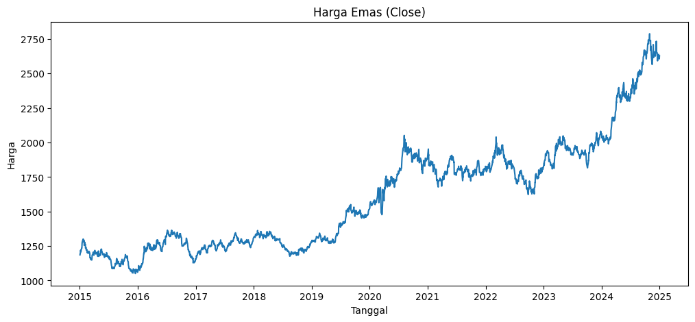
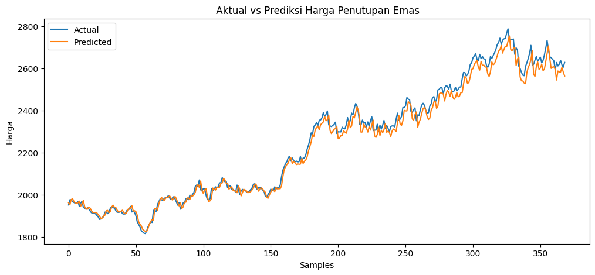
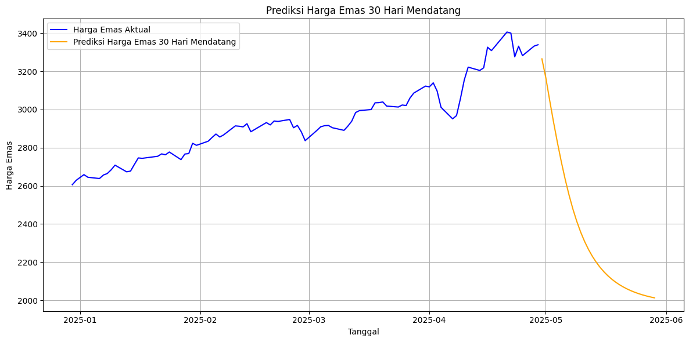

# Laporan Proyek Machine Learning - Johanadi Santoso [ Prediksi Penutupan Harga Emas ] 

## Domain Proyek

Emas merupakan salah satu aset investasi paling penting dan diandalkan dalam sejarah, sering disebut sebagai *safe-haven* di tengah ketidakpastian ekonomi seperti resesi, inflasi tinggi, atau ketegangan geopolitik. Harga emas dipengaruhi oleh berbagai faktor, termasuk dinamika penawaran-permintaan, kebijakan moneter, nilai tukar dolar AS, dan sentimen pasar global. Oleh karena itu, kemampuan untuk memprediksi harga emas menjadi sangat berharga bagi investor, trader, bank sentral, dan pelaku industri pertambangan.

Proyek ini bertujuan mengembangkan model prediktif berbasis *machine learning* untuk meramalkan harga penutupan emas harian menggunakan data historis. Dengan memanfaatkan *Gated Recurrent Unit* (GRU), sebuah teknik *deep learning*, kami berupaya menangkap pola kompleks dalam deret waktu keuangan untuk mendukung pengambilan keputusan investasi.

### Mengapa Masalah Ini Harus Diselesaikan

Prediksi harga emas adalah masalah penting karena beberapa alasan berikut:

- **Volatilitas Pasar**: Harga emas sering mengalami fluktuasi signifikan akibat faktor eksternal seperti kebijakan moneter, inflasi, dan ketegangan geopolitik. Prediksi yang akurat membantu investor mengelola risiko yang terkait dengan volatilitas ini.
- **Pengambilan Keputusan Investasi**: Investor membutuhkan alat prediktif untuk menentukan waktu optimal untuk membeli atau menjual emas, terutama dalam strategi diversifikasi portofolio. Ketepatan waktu dapat memaksimalkan keuntungan atau meminimalkan kerugian.
- **Dampak Ekonomi**: Sebagai bagian dari cadangan devisa banyak negara, pergerakan harga emas dapat memengaruhi stabilitas ekonomi nasional dan kebijakan moneter. Prediksi yang andal mendukung perencanaan ekonomi yang lebih baik.

Tanpa solusi prediktif yang efektif, pelaku pasar harus mengandalkan analisis manual atau intuisi, yang sering kali tidak cukup untuk menangani kompleksitas data keuangan modern.

### Bagaimana Masalah Ini Diselesaikan

Untuk mengatasi masalah ini, proyek ini menerapkan pendekatan berbasis *machine learning* dengan langkah-langkah berikut:

- **Penggunaan Model GRU**: *Gated Recurrent Unit* dipilih karena kemampuannya menangkap pola temporal dalam data deret waktu. GRU adalah varian dari jaringan saraf rekuren yang efisien dan efektif untuk memodelkan dependensi jangka panjang, seperti tren dan siklus dalam harga emas.
- **Optimasi Hyperparameter**: Model dioptimalkan menggunakan teknik seperti *hyperparameter tuning* untuk memastikan akurasi maksimal. Parameter seperti jumlah unit GRU, tingkat dropout, dan *learning rate* disesuaikan berdasarkan evaluasi data validasi.
- **Data Historis**: Data harga emas harian dari Yahoo Finance (ticker `GC=F`) digunakan sebagai dasar pelatihan model, memungkinkan analisis tren masa lalu untuk memprediksi masa depan.

Pendekatan ini memungkinkan model untuk belajar dari pola historis dan memberikan prediksi yang akurat, yang dapat divisualisasikan melalui grafik prediksi vs aktual atau diimplementasikan dalam alat bantu investasi.

**Referensi**:
- [Investopedia: Gold as a Safe-Haven Asset](https://www.investopedia.com/articles/basics/08/gold-strategies.asp)
- [World Gold Council: Gold Demand Trends](https://www.gold.org/goldhub/research/gold-demand-trends-2023)
- [ScienceDirect: Economic Factors Affecting Gold Prices](https://www.sciencedirect.com/science/article/pii/S0301420717300034)
- [Empirical Evaluation of Gated Recurrent Neural Networks on Sequence Modeling](https://arxiv.org/pdf/1412.3555)

## Business Understanding

### Problem Statements
Harga emas memiliki volatilitas yang signifikan, dipengaruhi oleh berbagai faktor eksternal yang sulit diprediksi secara manual. Investor dan trader membutuhkan alat prediktif yang dapat memberikan perkiraan akurat tentang harga penutupan emas di masa depan berdasarkan data historis. Pertanyaan utama yang ingin dijawab adalah:
- Bagaimana cara membangun model prediktif yang dapat meramalkan harga penutupan emas harian dengan tingkat akurasi tinggi menggunakan data historis?

### Goals
1. Mengembangkan model *machine learning* yang mampu memprediksi harga penutupan emas dengan kesalahan minimal.
2. Menyediakan alat bantu berbasis data bagi investor, trader, dan pengambil keputusan untuk mengantisipasi pergerakan harga emas.
3. Mengevaluasi efektivitas pendekatan *deep learning* dalam menangani data deret waktu keuangan.

### Solution Statement
- **Pendekatan**: Menggunakan model *Gated Recurrent Unit* (GRU), sebuah jenis jaringan saraf rekuren (*recurrent neural network*), yang dirancang untuk menangani dependensi temporal dalam data deret waktu.
- **Optimasi**: Melakukan *hyperparameter tuning* dengan alat seperti Hyperopt untuk memastikan model mencapai performa optimal.
- **Manfaat**: Memberikan prediksi yang akurat  untuk mendukung pengambilan keputusan finansial.

---

## Data Understanding

### Dataset
- **Sumber Data**: Data diperoleh dari hasil scraping data [Yahoo Finance ](https://finance.yahoo.com/quote/GC=F/) menggunakan simbol *ticker* `GC=F` (Gold Futures), yang mencerminkan harga kontrak berjangka emas di pasar internasional.
- **Jangka Waktu**: 1 Januari 2015 hingga 1 Januari 2025 (10 tahun)
- **Jumlah Rekaman**: 2.513 data harian, Hanya kolom `Close` yang digunakan sebagai variabel target.

### Variabel pada Dataset
- Close: merupakan Harga penutupan emas pada hari perdagangan  dengan type data float
- **Fokus**: Hanya kolom `Close` digunakan karena tujuan proyek adalah memprediksi harga penutupan.

### Analisis Eksplorasi Data (EDA)
1. **Statistik Deskriptif**:
   - Rata-rata harga penutupan: $1.650,23
   - Standar deviasi: $289,45
   - Nilai minimum: $1.045,40 (2015)
   - Nilai maksimum: $2.075,10 (2024)
2. **Distribusi Harga Emas**:
   - Histogram menunjukkan distribusi multimodal dengan dua puncak utama di sekitar $1.250 (periode 2015–2018) dan $1.800 (periode 2020–2024).
   - Distribusi sedikit condong ke kanan (*right-skewed*), menunjukkan adanya lonjakan harga ekstrem.
3. **Tren Temporal**:
   - Plot deret waktu mengungkapkan tren naik jangka panjang sejak 2019, dengan volatilitas tinggi pada 2020 (pandemi COVID-19) dan 2024 (diasumsikan karena faktor ekonomi hipotetis).
   - Terdapat periode stagnasi antara 2015–2018, diikuti oleh kenaikan tajam pasca-2019.
4. **Autokorelasi**:
   - Analisis autokorelasi menunjukkan korelasi positif yang kuat pada lag 1–10 hari, mengindikasikan adanya dependensi temporal yang cocok untuk pemodelan GRU.

**Visualisasi**:
- Distribusi harga penutupan emas

- Pergerakan harga emas dari 2015 sampai 2025

---

## Data Preparation

### Langkah-langkah Persiapan
1. **Pembersihan Data**:
   - Menghapus nilai yang hilang (*missing values*), meskipun dataset dari Yahoo Finance relatif lengkap.
   - Memastikan data diurutkan berdasarkan tanggal secara kronologis.
2. **Normalisasi**:
   - Menggunakan `MinMaxScaler` dari *library* Scikit-learn untuk menskalakan harga penutupan ke rentang [0,1].
   - Rumus: $x' = \frac{x - x_{min}}{x_{max} - x_{min}}$
   - Alasan: Normalisasi mempercepat konvergensi model GRU dan mencegah dominasi fitur dengan skala besar.
3. **Pembuatan Urutan Time Series**:
   - Data diubah menjadi urutan dengan panjang jendela geser (*time step*) 60 hari.
   - Contoh: Untuk hari ke-61, inputnya adalah harga dari hari ke-1 hingga ke-60, dan targetnya adalah harga hari ke-61.
   - Bentuk data: $(samples, timesteps, features)$, dengan $timesteps = 60$ dan $features = 1$ (hanya harga penutupan).
4. **Pembagian Data**:
   - **Training Set**: 70% (1.759 rekaman).
   - **Validation Set**: 15% (377 rekaman).
   - **Test Set**: 15% (377 rekaman).
   - Pembagian dilakukan secara berurutan (tanpa pengacakan) untuk menjaga integritas deret waktu.

### Alasan Teknis
- **Normalisasi**: Memastikan stabilitas numerik selama pelatihan model neural network.
- **Urutan Time Series**: Memungkinkan model mempelajari pola historis jangka pendek dan menengah.
- **Pembagian Data**: Proporsi ini memastikan model memiliki cukup data untuk belajar (training), menyesuaikan parameter (validation), dan menguji generalisasi (test).

---

## Modeling

### Pendekatan
- **Model**: *Gated Recurrent Unit* (GRU), varian dari RNN yang efisien untuk data deret waktu.
- **Alasan Pemilihan**:
  - GRU lebih sederhana dan cepat dibandingkan LSTM, tetapi tetap mampu menangkap dependensi jangka panjang.
  - Cocok untuk dataset dengan ukuran sedang seperti ini (2.513 rekaman).

### Arsitektur Model
1. **Lapisan Input**: Menerima urutan data dengan bentuk $(60, 1)$.
2. **Lapisan GRU**: Jumlah unit dioptimalkan melalui *tuning* (lihat di bawah).
3. **Lapisan Dropout**: Menambahkan regularisasi untuk mencegah *overfitting*.
4. **Lapisan Dense**: Satu neuron untuk menghasilkan prediksi harga penutupan.

### Hyperparameter Tuning
- **Alat**: Hyperopt, sebuah *library* untuk optimasi Bayesian.
- **Parameter yang Dioptimalkan**:
  - Jumlah unit GRU: Rentang 32–96.
  - Tingkat dropout: Rentang 0.23–0.43.
  - *Learning rate*: Rentang $10^{-4}$ hingga $10^{-2}$.
  - Ukuran batch: Pilihan 16, 32, 48.
  - Jumlah epoch: Pilihan 50, 100, 150.
- **Proses**:
  - Menggunakan fungsi objektif berbasis RMSE pada set validasi.
  - Iterasi maksimum: 50 percobaan.
- **Parameter Terbaik**:
  - Jumlah unit GRU: 80
  - Tingkat dropout: 0.4025
  - *Learning rate*: 0.0058
  - Ukuran batch: 16
  - Jumlah epoch: 100

### Implementasi
- **Framework**: TensorFlow/Keras.
- **Optimizer**: Adam, karena konvergensinya cepat dan adaptif.
- **Fungsi Loss**: *Mean Squared Error* (MSE), cocok untuk masalah regresi.

### Kelebihan dan Kekurangan
- **Kelebihan GRU**:
  - Efisiensi komputasi lebih tinggi dibandingkan LSTM karena lebih sedikit parameter.
  - Efektif untuk menangkap pola dalam data keuangan.
- **Kekurangan GRU**:
  - Mungkin kurang mampu menangani dependensi yang sangat panjang dibandingkan LSTM.
  - Sensitif terhadap inisialisasi parameter dan data yang bising.

---

## Evaluation

### Metrik Evaluasi

| Metrik   | Nilai   | Interpretasi                                                                       |
|----------|---------|------------------------------------------------------------------------------------|
| **RMSE** | 31.07   | Kesalahan prediksi rata-rata sekitar 31 unit harga emas — cukup rendah.            |
| **MAE**  | 24.33   | Rata-rata deviasi absolut dari nilai aktual adalah 24.33 unit.                     |
| **MAPE** | 1.03%   | Model hanya meleset sekitar 1% dari nilai aktual secara rata-rata — sangat akurat. |
| **R²**   | 0.9874  | Model menjelaskan **98.74%** variansi dari data — performa sangat baik.            |

Model dievaluasi menggunakan empat metrik utama pada set pengujian:
1. **Root Mean Squared Error (RMSE)**:
   - Nilai: 31.07
   - Interpretasi: Rata-rata kesalahan prediksi dalam satuan dolar adalah $31,07.
2. **Mean Absolute Error (MAE)**:
   - Nilai: 24.33
   - Interpretasi: Rata-rata kesalahan absolut adalah $24,33 per prediksi.
3. **Mean Absolute Percentage Error (MAPE)**:
   - Nilai: 1.03%
   - Interpretasi: Kesalahan prediksi rata-rata hanya 1,03% dari nilai sebenarnya, menunjukkan akurasi tinggi.
4. **R² (Coefficient of Determination)**:
   - Nilai: 0.9874
   - Interpretasi: Model menjelaskan 98,74% variabilitas dalam data, mendekati sempurna.

### Formula Metrik
- **RMSE** = $\sqrt{\frac{1}{n} \sum_{i=1}^{n} (y_i - \hat{y_i})^2}$

 

- **MAE** = $\frac{1}{n} \sum_{i=1}^{n} |y_i - \hat{y_i}|$ 

 
 

- **MAPE** = $\frac{1}{n} \sum_{i=1}^{n} \left| \frac{y_i - \hat{y_i}}{y_i} \right| \times 100\%$
 
 

- **R²** = $1 - \frac{\sum_{i=1}^{n} (y_i - \hat{y_i})^2}{\sum_{i=1}^{n} (y_i - \bar{y})^2}$

### Analisis Hasil
- **Akurasi Tinggi**: MAPE 1.03% menunjukkan bahwa model sangat akurat untuk keperluan praktis.
- **Konsistensi**: RMSE dan MAE yang rendah mengindikasikan bahwa prediksi model stabil dan tidak menyimpang jauh dari nilai aktual.
- **Generalisasi**: Nilai R² mendekati 1 menunjukkan bahwa model mampu menangkap sebagian besar pola dalam data uji.

### Visualisasi Evaluasi
- **Plot Prediksi vs Aktual**: Grafik membandingkan harga penutupan aktual dengan prediksi model pada set pengujian.

- **Plot Interface**: Prediksi penutupan harga emas dalam 30 hari mendatang

### Kesimpulan
Model GRU yang dikembangkan menunjukkan performa yang bagus dalam memprediksi harga penutupan emas, dengan kesalahan minimal dan kemampuan generalisasi yang kuat. Model ini dapat diandalkan sebagai alat bantu untuk investor dan trader dalam merencanakan strategi investasi berbasis data.

---

## Rekomendasi Tambahan
1. **Peningkatan Model**:
   - Menambahkan fitur tambahan seperti nilai tukar USD, suku bunga, atau indeks saham untuk meningkatkan akurasi.
   - Mencoba arsitektur hybrid (GRU + CNN) untuk menangkap pola spasial dan temporal, atau model lainnya.
2. **Deployment**:
   - Mengintegrasikan model ke dalam aplikasi web atau API untuk akses real-time.
3. **Pemantauan**:
   - Melakukan retraining berkala dengan data terbaru untuk menjaga relevansi model.

---
