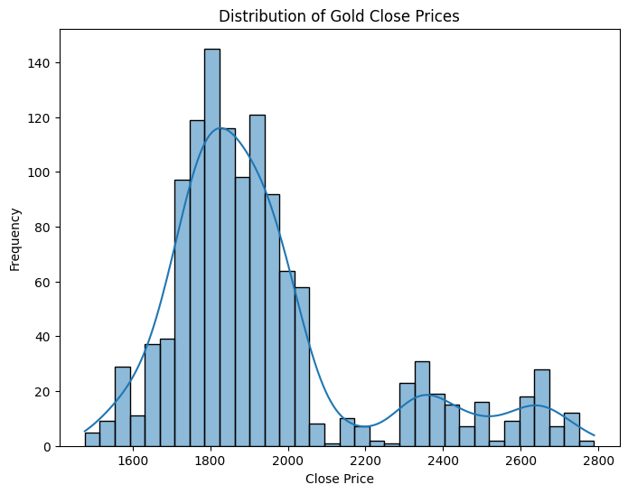
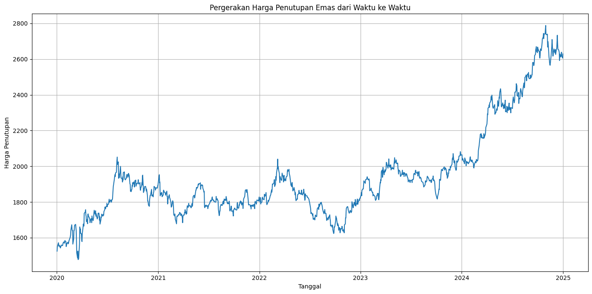
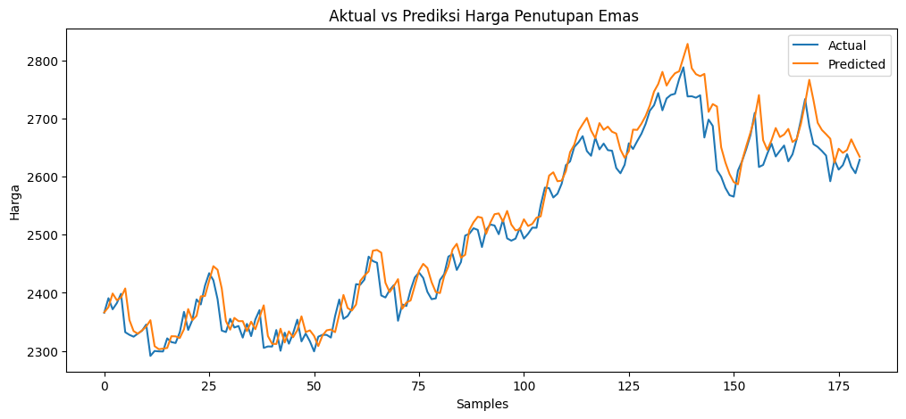

# Laporan Proyek Machine Learning - Johanadi Santoso 

### Analisis Prediktif Harga Emas Menggunakan Model LSTM dan GRU

> **Nama:** Johanadi Santoso  
  **Email:** johanadisantoso1@gmail.com  
  **ID Dicoding:** johanadisantoso  

---

## 1. Domain Proyek

Harga emas merupakan salah satu indikator ekonomi global yang signifikan dan sering dianggap sebagai aset *safe-haven* oleh investor di tengah ketidakpastian ekonomi. Fluktuasi harga emas dipengaruhi oleh berbagai faktor kompleks, termasuk tingkat inflasi, pergerakan nilai tukar mata uang (khususnya dolar AS), ketidakpastian geopolitik, serta dinamika penawaran dan permintaan di pasar global. Dalam konteks ini, kemampuan untuk memprediksi harga emas secara akurat dapat memberikan keunggulan kompetitif bagi investor, pelaku pasar keuangan, dan institusi yang mengelola portofolio investasi.

Proyek ini bertujuan untuk mengembangkan model prediktif berbasis *deep learning* guna memperkirakan harga penutupan emas harian menggunakan data historis. Dua pendekatan utama yang digunakan adalah **LSTM (*Long Short-Term Memory*)** dan **GRU (*Gated Recurrent Unit*)**, yang keduanya merupakan varian dari *Recurrent Neural Networks* (RNN) yang dirancang khusus untuk menangani data *time series*. Dengan memanfaatkan pola temporal dalam data harga emas, proyek ini berupaya memberikan wawasan yang dapat ditindaklanjuti untuk pengambilan keputusan investasi.

**Referensi Utama:**
- Yahoo Finance. *Historical Gold Prices*. Diakses dari: [Yahoo Finance](https://finance.yahoo.com/quote/GC%3DF/history/)
- Dataset: Data harga emas harian dari 2020 hingga 2025, diunduh dari Yahoo Finance.

---

## 2. Business Understanding

### 2.1 Problem Statements

Proyek ini berfokus pada dua permasalahan utama:
1. **Pernyataan Masalah 1**: Bagaimana cara memanfaatkan data historis harga emas untuk memprediksi harga penutupan di masa depan dengan tingkat akurasi yang tinggi?
2. **Pernyataan Masalah 2**: Di antara dua model *deep learning*, yaitu LSTM dan GRU, manakah yang memberikan performa lebih baik dalam memprediksi harga emas berdasarkan metrik evaluasi standar?

### 2.2 Goals

Tujuan proyek ini dirancang untuk menjawab permasalahan di atas:
1. **Goal 1**: Membangun model prediktif berbasis *deep learning* yang mampu memberikan estimasi akurat untuk harga penutupan emas harian.
2. **Goal 2**: Melakukan perbandingan mendalam antara model LSTM dan GRU untuk menentukan pendekatan terbaik dalam konteks prediksi *time series* harga emas.

### 2.3 Solution Statements

Solusi yang diusulkan untuk mencapai tujuan tersebut meliputi:
- **Solution 1**: Mengembangkan dan mengoptimalkan model LSTM dan GRU melalui *hyperparameter tuning* untuk memastikan prediksi yang akurat.
- **Solution 2**: Mengevaluasi performa kedua model menggunakan metrik kuantitatif seperti *Root Mean Squared Error* (RMSE), *Mean Absolute Error* (MAE), *Mean Absolute Percentage Error* (MAPE), dan koefisien determinasi (R²) untuk menentukan model yang lebih unggul.

---

## 3. Data Understanding

Data diperoleh dari hasil scraping data [Yahoo Finance](https://finance.yahoo.com/quote/GC=F/) menggunakan simbol *ticker* `GC=F`, yang mencerminkan harga kontrak berjangka emas di pasar internasional. Dataset mencakup 1.258 entri dari tanggal 2 Januari 2020 hingga 31 Desember 2024. Dataset ini berisi informasi harga pembukaan (*Open*), harga tertinggi (*High*), harga terendah (*Low*), harga penutupan (*Close*), dan volume perdagangan (*Volume*).

### 3.1 Sumber Data

- **Tautan Sumber Data**: [Yahoo Finance - Gold Futures](https://finance.yahoo.com/quote/GC%3DF/history/)
- **Nama tiker**: `GC=F`
- **Jumlah Data**: 1258 baris, sesuai dengan jumlah hari perdagangan dalam periode 2020-2025 (dengan asumsi 251 hari perdagangan per tahun).

#### Kondisi Data Awal
- **Nilai yang Hilang**: Tidak ada nilai yang hilang (*missing values*) dalam dataset setelah pemeriksaan awal.
- **Duplikasi**: Tidak ditemukan baris duplikat berdasarkan kolom *Date*.
- **Outlier**: Analisis awal menunjukkan tidak adanya *outlier* signifikan yang dapat mengganggu model, meskipun fluktuasi tajam terjadi pada beberapa periode.

### 3.2 Deskripsi Fitur

Dataset terdiri dari beberapa kolom yang memberikan gambaran lengkap tentang pergerakan harga emas harian:

| **Fitur** | **Tipe Data** | **Deskripsi** |
|-----------|---------------|----------------|
| Date (index) | DatetimeIndex | Tanggal perdagangan (format: YYYY-MM-DD) |
| Close     | float64       | Harga penutupan emas (target prediksi) |
| High      | float64       | Harga tertinggi emas dalam satu hari |
| Low       | float64       | Harga terendah emas dalam satu hari |
| Open      | float64       | Harga pembukaan emas pada hari tersebut |
| Volume    | object        | Volume perdagangan emas pada hari itu (perlu konversi ke numerik) |

### 3.3 Exploratory Data Analysis (EDA)

Analisis eksplorasi data dilakukan untuk memahami karakteristik dataset sebelum pemodelan.

#### a. Distribusi Harga Penutupan

**Insight**:
- Distribusi harga penutupan emas menunjukkan pola yang mendekati distribusi normal dengan sedikit kemiringan positif (*positive skewness*).
- Rentang harga berkisar antara $1,600 hingga $2,500 per troy ounce, mencerminkan volatilitas pasar selama periode tersebut.

#### b. Tren Harga Emas (2020-2025)

**Insight**:
- Terdapat tren kenaikan harga emas secara keseluruhan dari 2020 hingga 2025.
- Fluktuasi signifikan terdeteksi pada tahun 2022 dan 2024, kemungkinan terkait dengan peristiwa ekonomi global seperti kenaikan suku bunga atau konflik geopolitik.

#### c. Korelasi Antar Fitur

**Insight**:
- Harga *Close* memiliki korelasi sangat tinggi (>0.95) dengan *Open*, *High*, dan *Low*, menunjukkan bahwa fitur-fitur ini saling berkaitan erat.
- *Volume* memiliki korelasi rendah dengan harga, sehingga pengaruhnya terhadap prediksi mungkin terbatas.

---

## 4. Data Preparation

Persiapan data merupakan langkah kritis untuk memastikan model dapat belajar dengan baik dari dataset.

### 4.1 Pembersihan Data
- Meskipun tidak ada nilai yang hilang atau duplikat, data diperiksa ulang untuk memastikan konsistensi format tanggal dan nilai numerik.

### 4.2 Normalisasi Data
- Data harga penutupan dinormalisasi menggunakan `MinMaxScaler` ke dalam rentang [0,1] untuk mempercepat konvergensi model *deep learning*.
- Rumus normalisasi:  
  $x' = \frac{x - x_{min}}{x_{max} - x_{min}}$

- Normalisasi diterapkan pada fitur *Close*

### 4.3 Pembentukan Data *Time Series*
- Data diubah menjadi format *sequence* menggunakan pendekatan *sliding window*.
- Ukuran jendela (*window size*) ditetapkan pada **60 hari**, yang berarti model akan menggunakan 60 hari sebelumnya untuk memprediksi harga penutupan hari berikutnya.
- Contoh:  
  - Input: Harga penutupan hari ke-1 hingga ke-60  
  - Output: Harga penutupan hari ke-61

### 4.4 Pembagian Dataset
- Dataset dibagi menjadi tiga subset untuk pelatihan dan evaluasi model:
  - **Training**: 70% (sekitar 880 baris)
  - **Validation**: 15% (sekitar 189 baris)
  - **Testing**: 15% (sekitar 189 baris)
- Pembagian dilakukan secara berurutan (tanpa pengacakan) untuk menjaga sifat temporal data.

---

## 5. Modeling

Dua model *deep learning* dikembangkan: **LSTM** dan **GRU**, dengan optimasi *hyperparameter* menggunakan pustaka `Hyperopt`.

### Model 1: LSTM (*Long Short-Term Memory*)

#### Pembahasan Cara Kerja
LSTM adalah jenis *Recurrent Neural Network* (RNN) yang dirancang untuk menangkap ketergantungan jangka panjang dalam data *sequence*. Arsitektur ini memiliki tiga *gate* utama: *forget gate*, *input gate*, dan *output gate*. *Forget gate* memutuskan informasi mana dari langkah waktu sebelumnya yang akan dibuang dari memori sel berdasarkan input saat ini dan status sebelumnya. *Input gate* menentukan informasi baru dari input yang akan disimpan ke dalam memori sel, sedangkan *output gate* mengontrol informasi mana yang akan diteruskan ke lapisan berikutnya atau menjadi output. Mekanisme ini memungkinkan LSTM untuk secara selektif menyimpan dan mengakses informasi dari langkah waktu yang jauh di masa lalu, menjadikannya sangat efektif untuk data *time series* seperti harga emas yang memiliki pola temporal kompleks.

#### Pembahasan Parameter
	
**Parameter Default yang Digunakan (Tidak Disesuaikan):**
- **Activation Function**: `tanh` untuk aktivasi sel dan `sigmoid` untuk *gate* (default Keras/TensorFlow).
- **Initializer**: Glorot Uniform untuk bobot kernel dan Recurrent Uniform untuk bobot berulang (default Keras/TensorFlow).

**Parameter model LSTM dioptimalkan menggunakan pustaka `Hyperopt` untuk mencapai performa terbaik:**
- **Units**: Jumlah unit LSTM dalam lapisan, diatur pada 96 setelah optimasi (bukan default).
- **Dropout**: Tingkat dropout untuk mencegah *overfitting*, diatur pada 0.295 setelah optimasi (bukan default).
- **Learning Rate**: Kecepatan pembelajaran optimizer, diatur pada 0.00184 setelah optimasi (bukan default, Nilai default pada  optimizer  Adam adalah  0.001).
- **Batch Size**: Ukuran batch untuk pelatihan, diatur pada 16 setelah optimasi (bukan default, default biasanya 32).
- **Epochs**: Jumlah iterasi pelatihan, diatur pada 100 setelah optimasi.

#### Kelebihan
- Efektif menangkap pola jangka panjang dalam data *time series*.
- Cocok untuk dataset dengan fluktuasi kompleks.

#### Kekurangan
- Proses pelatihan lebih lambat karena kompleksitas arsitektur.
- Memerlukan regularisasi ketat untuk menghindari *overfitting*.

---

### Model 2: GRU (*Gated Recurrent Unit*)

#### Pembahasan Cara Kerja
GRU adalah varian dari RNN yang lebih sederhana dibandingkan LSTM, dirancang untuk menangkap dependensi temporal dengan efisiensi komputasi yang lebih tinggi. GRU hanya memiliki dua *gate* utama: *update gate* dan *reset gate*. *Update gate* mengontrol seberapa banyak informasi dari langkah waktu sebelumnya yang akan dibawa ke langkah waktu saat ini, dengan memadukan input baru dan memori sebelumnya. *Reset gate* menentukan seberapa banyak informasi dari memori sebelumnya yang akan dilupakan sebelum menggabungkannya dengan input baru. Dengan struktur yang lebih ringkas ini, GRU dapat menawarkan performa yang kompetitif dibandingkan LSTM sambil mengurangi beban komputasi, menjadikannya pilihan yang baik untuk prediksi *time series* seperti harga emas.

#### Pembahasan Parameter

**Parameter Default yang Digunakan (Tidak Disesuaikan):**
- **Activation Function**: `tanh` untuk aktivasi dan `sigmoid` untuk *gate* (default Keras/TensorFlow).
- **Initializer**: Glorot Uniform untuk bobot kernel dan Recurrent Uniform untuk bobot berulang (default Keras/TensorFlow).

**Parameter model GRU juga dioptimalkan menggunakan `Hyperopt` untuk memastikan performa optimal:**
- **Units**: Jumlah unit GRU dalam lapisan, diatur pada 80 setelah optimasi (bukan default).
- **Dropout**: Tingkat dropout untuk regularisasi, diatur pada 0.4197 setelah optimasi (bukan default).
- **Learning Rate**: Kecepatan pembelajaran optimizer, diatur pada 0.0067 setelah optimasi (bukan default, Nilai default pada  optimizer  Adam adalah  0.001).
- **Batch Size**: Ukuran batch untuk pelatihan, diatur pada 32 setelah optimasi. 
- **Epochs**: Jumlah iterasi pelatihan, diatur pada 150 setelah optimasi.

#### Kelebihan
- Proses pelatihan lebih cepat dibandingkan LSTM.
- Performa kompetitif dengan kompleksitas lebih rendah.

#### Kekurangan
- Mungkin kurang optimal untuk pola yang sangat rumit atau ketergantungan jangka panjang yang ekstrem.

---

## 6. Evaluasi

Evaluasi dilakukan untuk mengukur performa kedua model pada data *testing* menggunakan metrik standar untuk tugas regresi.

### 6.1 Metrik Evaluasi
- **RMSE**: Mengukur rata-rata kesalahan kuadrat, sensitif terhadap kesalahan besar.  
  **RMSE** = $\sqrt{\frac{1}{n} \sum_{i=1}^{n} (y_i - \hat{y_i})^2}$

- **MAE**: Mengukur rata-rata kesalahan absolut, memberikan gambaran kesalahan tanpa mempertimbangkan arah.  
 **MAE** = $\frac{1}{n} \sum_{i=1}^{n} |y_i - \hat{y_i}|$

- **MAPE**: Mengukur kesalahan dalam bentuk persentase, memudahkan interpretasi relatif.  
**MAPE** = $\frac{1}{n} \sum_{i=1}^{n} \left| \frac{y_i - \hat{y_i}}{y_i} \right| \times 100\%$

- **R²**: Mengukur seberapa baik model menjelaskan variansi data. Nilai mendekati 1 menunjukkan performa baik.  
**R²** = $1 - \frac{\sum_{i=1}^{n} (y_i - \hat{y_i})^2}{\sum_{i=1}^{n} (y_i - \bar{y})^2}$

### 6.2 Hasil Evaluasi

| **Model** | **RMSE** | **MAE** | **MAPE** | **R²** |
|-----------|----------|---------|----------|--------|
| LSTM      | 46.50    | 39.86   | 1.56%    | 0.8960 |
| GRU       | 33.51    | 25.03   | 0.99%    | 0.9460 |

**Analisis**:
- **GRU** secara konsisten mengungguli LSTM pada semua metrik, dengan RMSE dan MAE lebih rendah serta R² lebih tinggi.
- MAPE GRU di bawah 1% menunjukkan tingkat akurasi yang sangat baik dalam konteks prediksi harga emas.

### 6.3 Visualisasi Prediksi

#### a. Prediksi vs Aktual - LSTM

**Insight**:
- LSTM mampu menangkap tren umum harga emas, tetapi cenderung kurang akurat pada fluktuasi jangka pendek.
- Beberapa puncak dan lembah tidak terdeteksi dengan presisi tinggi.
- LSTM menunjukkan kesalahan yang lebih besar pada beberapa titik ekstrem.

#### b. Prediksi vs Aktual - GRU

**Insight**:
- GRU menunjukkan kemampuan superior dalam menangkap fluktuasi harga, baik pada tren naik maupun turun.
- Prediksi lebih mendekati nilai aktual, terutama pada periode volatilitas tinggi dari pada LSTM.

---

## 7. Kesimpulan dan Rekomendasi

### 7.1 Kesimpulan
- **Performa Model**: GRU terbukti lebih unggul dibandingkan LSTM dalam memprediksi harga penutupan emas, dengan RMSE 33.51 (vs 46.50), MAE 25.03 (vs 39.86), MAPE 0.99% (vs 1.56%), dan R² 0.9460 (vs 0.8960).
- **Efisiensi**: GRU menawarkan keunggulan dalam hal kecepatan pelatihan dan akurasi, menjadikannya pilihan yang lebih praktis untuk aplikasi prediksi *time series*.
- **Aplikasi**: Kedua model dapat digunakan untuk prediksi jangka pendek, tetapi GRU lebih direkomendasikan karena performanya yang lebih baik.

### 7.2 Rekomendasi Bisnis
1. **Investasi Jangka Pendek**: Model GRU dapat diintegrasikan ke dalam sistem untuk mendukung keputusan beli atau jual emas secara real-time.
2. **Manajemen Risiko**: Prediksi harga emas membantu investor mengelola risiko volatilitas pasar dalam portofolio mereka.
3. **Pengembangan Produk Keuangan**: Institusi keuangan dapat memanfaatkan model ini untuk menciptakan alat analisis harga emas.

### 7.3 Pengembangan Lebih Lanjut
- **Fitur Tambahan**: Menambahkan variabel eksternal seperti tingkat inflasi, nilai tukar dolar AS, atau sentimen pasar dari berita untuk meningkatkan akurasi.
- **Arsitektur Alternatif**: Mengeksplorasi model seperti *Transformer* atau *Temporal Convolutional Networks* (TCN) untuk menangani pola yang lebih kompleks.
- **Prediksi Jangka Panjang**: Mengadaptasi model untuk prediksi jangka panjang dengan memperluas *window size* atau menggabungkan pendekatan *ensemble*.

---